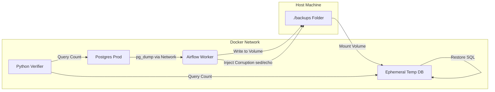

# Project Lazarus: Automated Data Integrity Pipeline

> **"Trust, but Verify."** — An automated chaos engineering platform that validates database backups by intentionally corrupting them.


## 📖 The Problem

In distributed systems, checking that a backup file "exists" isn't enough. Silent data corruption, version skew between client/server tools, and "phantom writes" can render backups useless when you need them most.

I built **Project Lazarus** to move beyond simple checks. It proves data integrity by acting as a "Chaos Monkey"—intentionally trying to break the data to verify that the validation logic actually catches it.

## 🛠 What It Does

This is a fully containerized pipeline that orchestrates the following lifecycle:

1. **Extraction:** Dumps a live Production database (Postgres 13) using an isolated Airflow worker.
2. **Sanitization:** Automatically handles version skew (e.g., stripping Postgres 17 config parameters from Postgres 13-compatible dumps) using stream editing (`sed`).
3. **Sabotage (Chaos Injection):** Injects malicious data (rogue rows) directly into the binary backup file to simulate corruption.
4. **Restoration:** Spins up an ephemeral "Clean Room" container and restores the sabotaged backup.
5. **Verification:** A Python engine connects to both Production and the Replica, performs row-count analysis (and future hashing), and alerts on discrepancies.

## Architecture

**The "Data Bridge" Pattern:**

Because the Airflow worker and Database containers have isolated filesystems, I architected a bridge using Docker Volume mounts to pass artifacts securely between the Host machine and the containerized environments.


## Engineering Decisions

### 1. Handling Version Skew

The Airflow environment uses the latest Postgres client tools (v17), while Production runs on v13. This caused unrecognized configuration parameter errors during restore.

**Solution:** Implemented a `sed` layer in the pipeline to sanitize the backup artifact on the fly, removing incompatible directives without altering the data.

### 2. "Fail Fast" Reliability

By default, `psql` ignores errors and continues execution, leading to "silent failures" where a restore fails but the pipeline stays Green.

**Solution:** Enforced `-v ON_ERROR_STOP=1` in all restore commands. If a single byte is wrong, the pipeline crashes immediately to alert the engineer.

### 3. Secure Secrets Management

No credentials are hardcoded.

**Solution:** All secrets use the `os.getenv` pattern. Credentials are injected via Docker Compose from a local `.env` file, ensuring no sensitive data is ever committed to Version Control.

##  How to Run

### Prerequisites

- Docker & Docker Compose

### Setup

1. **Clone the repository**
```bash
git clone https://github.com/Tmwakalasya/project-lazarus.git
cd project-lazarus
```

2. **Configure Secrets**

Create a `.env` file in the root directory (this file is git-ignored):
```ini
PROD_USER=prod_user
PROD_PW=prod_pass
PROD_DB=prod_db
```

3. **Launch the Stack**
```bash
docker-compose up -d --build
```

4. **Run the Pipeline**

- Navigate to http://localhost:8080 (User/Pass: `admin/admin` - check standalone logs if different).
- Trigger the `project_lazarus_verifier` DAG.
- Watch the fireworks: The "Sabotage" task will inject data, and the "Verify" task will raise an exception if it successfully detects the mismatch.

## What's Next
- **Multi-DB Support:** Extend beyond Postgres to MySQL, MongoDB
- **Performance Metrics:** Track restore time as a reliability KPI

## License

MIT

## Contributing

Pull requests welcome. For major changes, open an issue first to discuss proposed changes.

---

**Built with love and a healthy distrust of backups that haven't been tested.**
